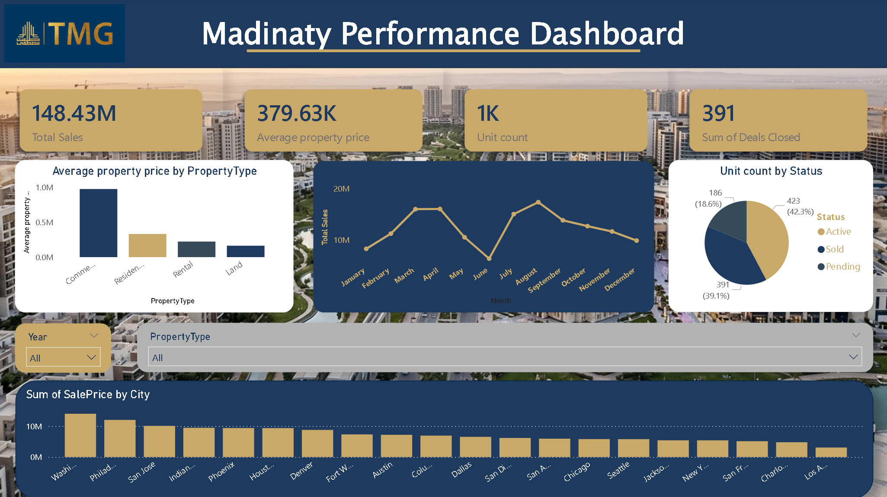

# madinaty-performance-dashboard

## Overview
Interactive Power BI dashboard for real estate sales analysis

## The dashboard provides insights into:

- Total sales performance
- Average property prices by property type
- Monthly sales trends
- Unit status distribution (Active, Sold, Pending)
- City-wise sales analysis
- Dynamic filtering by year and property type

## This project demonstrates skills in:

- Data cleaning and transformation
- Data visualization
- KPI analysis
- Dashboard design and UI/UX
- Business intelligence reporting

## Tools used:

- Microsoft Power BI
- Microsoft Excel for data preparation

## Dashboard Preview

